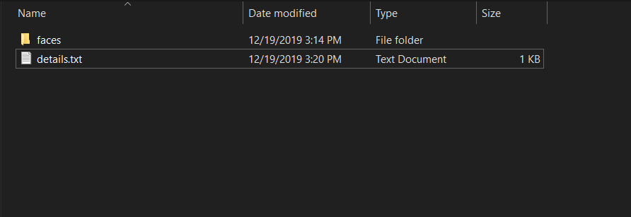
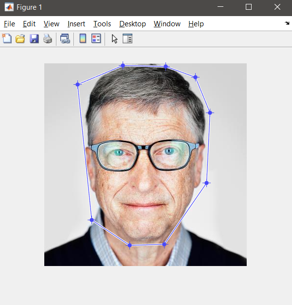
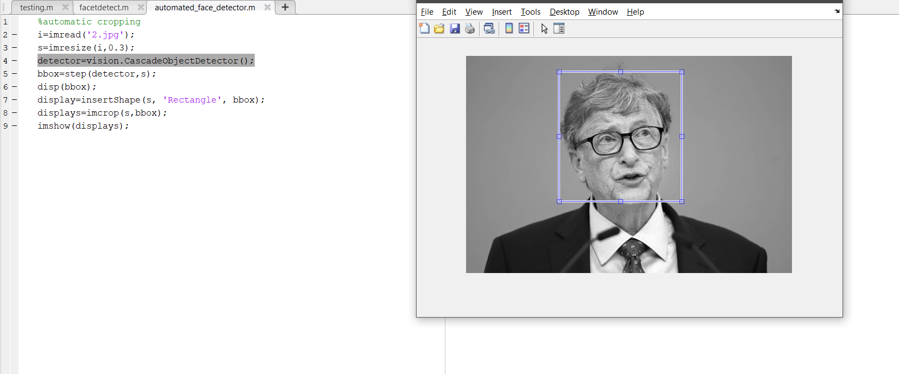
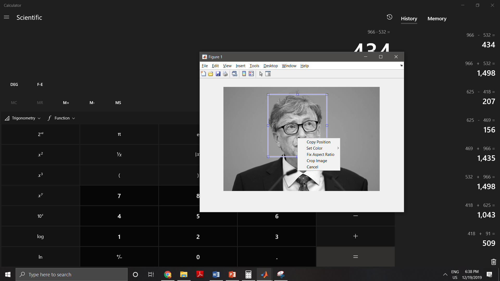
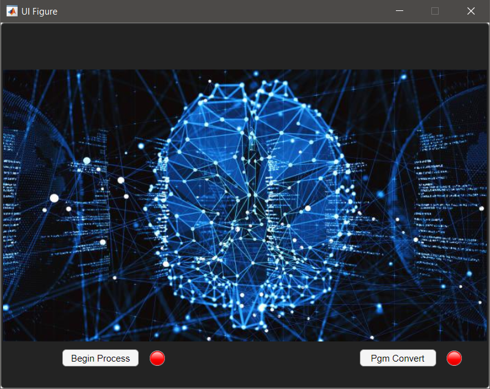
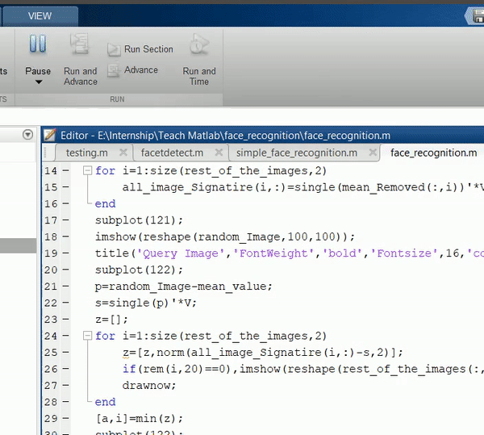

# [Eckovation](https://www.eckovation.com/) Matlab Final Internship Project
This is an internship project for Matlab course created by Eckovation to build a Homogenous Image Dataset and performing Facial Identification in Matlab
Problem: Create a UI that browses for certain faces and obtains the image in real time to identify the faces in the newly fed image. Use Matlab App designer to create the UI.

Step 1: Create your custom dataset using Matlab. Download the existing image dataset folder as a zip file from this link and extract it to a folder face_recognition. After completing the download, your face_recognition folder should look like this:



Step 2: From the previous lessons and tutorials make a UI window using app designer which loops in this folder and browses all the images from every sub directory and asks user to crop the image and crops it to save as a greyscale image after performing desired cropping and then converting the image to grayscale. The program should go like this: Running the user UI->Navigating to faces-> directory with the name “0”-> Browsing images one by one-> cropping from user-> Converting into grayscale and then saving the image.
	Sub steps:
1.	Create a UI and give a background button with the image of your choice to make it look more intuitive. Here, this image has been used. 
2.	Keep a browse button to add the functionality as mentioned in the step two.
3.	Now comes the challenging part, with the help of the functions, uigetdir(),dir(),setdiff(),fullfile(), and nested for loop navigate into the directory to load the images in sequence. The navigation should go like faces->0->1.jpg …. Until faces->5->9.jpg. Note that this is the way you will be able to access all the images and crop the faces out of those images convert them into grayscale and then save them in a new grayscale dataset. Here’s the complete piece of code to navigate through the directories and browsing the image:

```
global selected_directory;
global Subdirectory;
global Number_of_subfolders_in_subdirectories;
selected_directory=uigetdir();
Subdirectory = dir(fullfile(selected_directory,'*'));
```
There are various methods to perform cropping, the major classification is based on manual cropping in which you select the ROI and accordingly do the cropping(using roipoly, try to perform manual cropping using roipoly or ginput in a static image and look how it works, below is the image attached for the same) 



whereas the other one is automatic face detection and cropping. In this case, using cascade classifiers, cropping is performed. Although automatic face detection and cropping sounds quick but Matlab vision library is not very accurate with false positives. False positives are the elements which get detected additionally with the actual face. Below are some examples of false positive detection in Matlab:


In order to get rid of such problems, we need to resize the image to small dimensions and so classifier can focus on critical points easily. To perform the automatic cropping we will use CascadeObjectDetector from vision library. As a challenge, try to use ginput function to manually crop 5 10 images and then repeat the procedure with automated cropping. Here’s the code for automated cropping: 

```
i=imread('2.jpg');
s=imresize(i,0.3);
detector=vision.CascadeObjectDetector();
bbox=step(detector,s);
disp(bbox);
display=insertShape(s, 'Rectangle', bbox);
displays=imcrop(s,bbox);
```
Read the above code carefully to understand the logic of automated cropping, now modify this piece of code in your callback function of begin process to crop all the images and store it the same directory but with a different extension, i.e. .png format. Before saving the images make sure to print the image location and directory and then proceed accordingly so that you can ensure you are operating in the right directory. Here’s another challenge, using the command cd (which is to change Matlab working directory) and fileparts to extract the filename try to save the image within the same working directory. So for example if my 1.jpg is being read from “0” folder then 1.png which is the cropped and grayscale image (using the function rgb2gray) must be saved in the same “0” directory with the name 1.png. Here by using fileparts, you can ensure that both the file names are same with different image extensions. In this way, while training the dataset, it will be easier for you to perform the training.
One important thing to consider in the above code is also that we need to resize the body twice so that we can obtain uniform size for all the images.

Note: Although we have taken all precautious measures to ensure that our automated cropping goes smooth, but due to lighting and other effects, there are chances that faces might not be detected. In those cases, the benefit of using imcrop is that even if the face co-ordinates (bounding box) are not detected but still it will pop-up the image with manual cropping action as shown in the figure below. You need to select ROI and then proceed with the further processing by right clicking once you’re done selecting ROI and then clicking crop image.




4.	Now we are completely done with creating a clean and nice dataset to be trained. A very small step which needs to be added is to convert all these images to .pgm format so that it will be easy for Matlab to identify and train these images. Let’s make an interactive way of figuring out once all the image cropping has been done by putting an LED (identified as Lamps in widget tree of app designer) which will turn green once, image dataset is created.
Here is the complete code for this particular callback function:

```
global selected_directory;
global Subdirectory;
global Number_of_subfolders_in_subdirectories;
            selected_directory=uigetdir();
            Subdirectory = dir(fullfile(selected_directory,'*'));
            detector=vision.CascadeObjectDetector();
            %totalI=0;
            Number_of_subfolders_in_subdirectories = setdiff({Subdirectory([Subdirectory.isdir]).name},{'.','..'});
            for ii = 1:numel(Number_of_subfolders_in_subdirectories)
                Imagepaths = dir(fullfile(selected_directory,Number_of_subfolders_in_subdirectories{ii},'*.jpg')); 
                C = {Imagepaths(~[Imagepaths.isdir]).name};
                disp(C);
                for jj = 1:numel(C)
                    F = fullfile(selected_directory,Number_of_subfolders_in_subdirectories{ii},C{jj});
                    [ext,name,ext] = fileparts(F);
                    try
                    imageread=imread(F);
                    %totalI=totalI+1;
                    s=imresize(imageread,0.4);
                    s=rgb2gray(s);
                    bbox=step(detector,s);
                    imagecropped=imcrop(s,bbox);
                    imagecropped=imresize(imagecropped,[100,100]);
                    actual_D=F(1:52);
                    cd(actual_D);
                    imwrite(imagecropped,strcat(name,'.png'));
                    catch
                        continue;
                    end
                end
            end
            app.initialprocessled.Color=[0,1,0];
```

5.	Right after LED goes green, we will create another automation code to convert all the png images and save them as .pgm files. This code will be triggered by another button which says convert to .pgm files. Here’s how our new UI looks after the modifications.


6.	In converting .pgm files, we need to again loop through directories and sub directories and so either we can make new variables and redo the above processing by subtracting the processing code or just use global variables which can be accessed to both the callback functions and hence make our life easier. So whatever code fragment you have made in the first loop, just change those variables to global so that they can be accessed by the second function. Another solution to this problem is completely converting all the .png and .pgm file with just one callback, but using two buttons, the code becomes more readable and refractable and process flow can also be understood by the user. Syntax to globalize a variable is as shown below:

```
global var;
var=<whatever initialization you want to make> %Variable initialization
```
Now the same syntax will be followed while using this variable to the second callback function. 
7.	A very small yet prominent change will be reading for ‘*.png’ files this time instead of ‘*.jpg’ files which we used previously, as this time we are operating in processed png files and not unprocessed jpg files. Remove all the processing part that was automated cropping resizing and gray scaling, and keep rest of the code as it is. Again change .png in imwrite to .pgm file. One final small change you need to do is to modify LED name for the second LED and that’s it, everything’s done. Just save the code, and press the run button to see the magic!
Now we are done with our initial processing, we have obtained a clean dataset which could be fed to train using advanced HOG features for facial identification. Here we learned facial identification, automated facial cropping, gray scaling of images, making intuitive UIs, etc. After facial identification, facial recognition is completely wide domain, which could be discussed in another big project. For testing purposes, try using [this](https://github.com/sedhha/EckovationMatlabProject/blob/master/face_recognition.m) code which is taken from [this repo](https://www.nzfaruqui.com/face-recognition-using-matlab-implementation-and-code/), once you are done creating dataset to check the accuracy of basic facial recognition script. 


